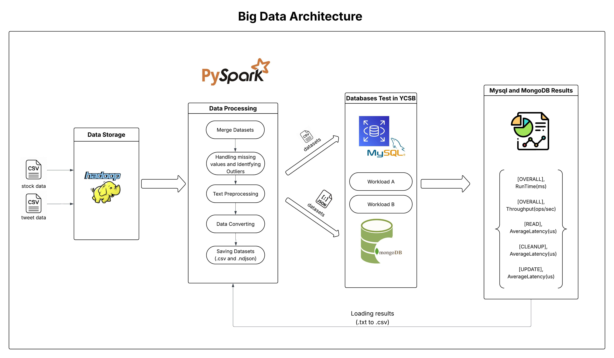

# Sentiment-Enhanced Time Series Forecasting and Database Performance Analysis

## 📌 Project Overview

This project focuses on forecasting stock prices by combining **historical financial data** with **sentiment extracted from social media (tweets)**. Predictions are generated for **Tesla, Apple, Amazon, Nvidia, and Netflix** over **1-day, 3-day, and 7-day horizons** using both statistical and deep learning models.

In addition to forecasting, the project includes a **comparative performance analysis of MySQL and MongoDB** using the **Yahoo! Cloud Serving Benchmark (YCSB)** to evaluate database performance under big data workloads.

The complete pipeline integrates **big data storage, distributed processing, sentiment analysis, time series modeling, and database benchmarking**.

---

## 🎯 Objectives

- Improve stock price forecasting accuracy using sentiment-aware models  
- Compare classical and deep learning time series approaches  
- Evaluate MySQL and MongoDB performance under read-heavy and update-heavy workloads  
- Demonstrate scalable data processing using Hadoop and Spark  

---

## 🏗️ Big Data Architecture

The following diagram illustrates the end-to-end architecture used in this project, covering data storage, distributed processing, benchmarking, and result analysis.



### Architecture Flow
- Raw stock and tweet data are stored in **HDFS**
- **PySpark** performs preprocessing, cleaning, sentiment aggregation, and dataset merging
- Processed datasets are benchmarked using **MySQL** and **MongoDB** via YCSB
- Performance metrics are collected, converted, and visualized for comparison

---

## 🧠 Models and Methods

### Time Series Forecasting
- **SARIMAX**
  - Incorporates sentiment scores as exogenous variables
  - Model order selected using Auto ARIMA

- **LSTM (Long Short-Term Memory)**
  - Captures nonlinear temporal dependencies
  - Hyperparameter tuning via GridSearchCV and RandomizedSearchCV

### Sentiment Analysis
- Natural Language Processing (NLP) techniques applied to tweets
- Sentiment scores aligned temporally with stock price data

---

## ⚙️ Big Data & Storage Technologies

- **Apache Hadoop (HDFS)** – Large-scale data storage  
- **Apache Spark (PySpark)** – Distributed preprocessing and sentiment extraction  
- **MySQL** – Relational database benchmarking  
- **MongoDB** – NoSQL database benchmarking  

---

## 🗄️ Database Performance Benchmarking

The Yahoo! Cloud Serving Benchmark (YCSB) is used to compare database performance under:

- **Workload A** – Update-heavy workload  
- **Workload B** – Read-heavy workload  

### Evaluation Metrics
- Throughput (operations per second)
- Overall runtime
- Read latency
- Update latency
- Cleanup latency

---

## 📓 Notebooks Overview

The workflow is intentionally split into two notebooks to separate **data engineering** and **analysis** tasks.

```text
notebooks/
├── 01_pyspark_data_processing.ipynb
└── 02_analysis_and_forecasting.ipynb

---

## 👤 Author
**Mesut UGUR**  
MSc Data Analytics 


